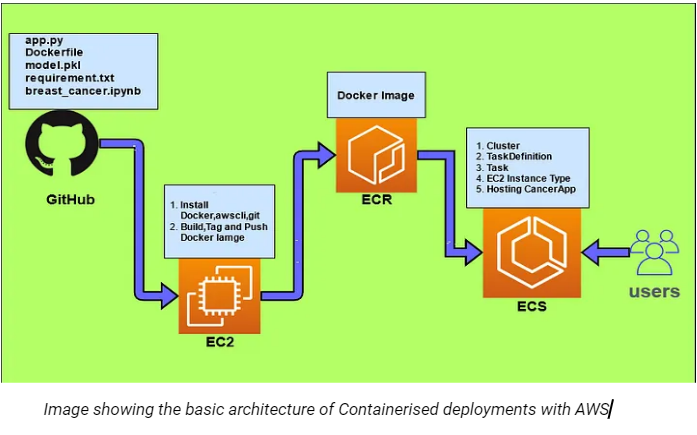

# Face Similarity Detection AI

- Run the API using `python3 main.py`.
- To test if API is working, visit `http://127.0.0.1:8000/test`.
- To test API endpoint using Fast Docs, visit `http://127.0.0.1:8000/docs`

## Building an API

### Steps

1. Exporting the model in h5 format:

   - This step involves saving the trained AI model in the Hierarchical Data Format (HDF5) format, commonly denoted by the `.h5` extension.
   - HDF5 is a file format designed to store and organize large amounts of data efficiently. It's widely used in the machine learning community for saving models, datasets, and other structured data.
   - When exporting the model to the h5 format, we can ensure that it can be easily loaded and utilized in other environments or frameworks.

2. Creating a starter API with FAST-API in Python:

   - FastAPI is a modern, fast (high-performance), web framework for building APIs with Python 3.7+ based on standard Python type hints.
   - This step involves setting up a FastAPI project, which provides a foundation for building a web API that can serve your machine learning model.
   - FastAPI's asynchronous capabilities make it particularly suitable for handling high loads and concurrent requests, which is beneficial for serving machine learning models in production environments.

3. Importing the model & required dependencies:

   - Before you can use the model in your API, you need to import it along with any necessary dependencies or libraries.
   - This typically includes importing libraries. In our case, we have FastAPI, TensorFlow, NumPy, Pillow, and Uvicorn as major dependencies.

4. Making the "/predict" POST route, which accepts 3 images from the user:

   - In this step, you define a POST endpoint "/predict" in your FastAPI application, which accepts three images as input from the client.
   - These images consist of one anchor image and two comparison images (img1 and img2).
   - The use of a POST request allows clients to send data (in this case, images) to the server for processing.

5. The model will tell us which image resembles the anchor image:

   - Once the server receives the images, the machine learning model is invoked to compare the similarity between the anchor image and the two comparison images.
   - The model computes a similarity score or makes a binary decision indicating which comparison image more closely resembles the anchor image based on the learned features.

6. Returning the result in JSON format to the client:
   - After the model has processed the input images and made its comparison, the result is formatted into a JSON (JavaScript Object Notation) response.
   - The JSON response typically includes the outcome of the comparison, such as the ID or filename of the image that most closely resembles the anchor image, along with any relevant metadata or confidence scores.

### References

- [A Step-by-Step Approach to Building a FastAPI for Deep Learning Classification Projects](https://medium.com/@ganiyuabdulwajeed2002/a-step-by-step-approach-to-building-a-fast-api-for-deep-learning-classification-projects-cbd2ea6bc2f2)
- [FastAPI Machine Learning](https://testdriven.io/blog/fastapi-machine-learning/)
- [Building a Machine Learning Microservice with FastAPI](https://developer.nvidia.com/blog/building-a-machine-learning-microservice-with-fastapi/)

## Taking the API to Production

This API can be deployed as a containerized FastAPI Application on Amazon Web Services (AWS). Using Docker is optional, but a preferred option due to its benefits such as portability, scalability, and resource efficiency. By containerizing our application, we can achieve improved scalability, portability, and resource isolation.
Although the services that'll be required to deploy this to AWS ECS go beyond the Free Tier limits. Hence we'll be highlighting all steps in detail related to AWS, but for the scope of this project, we'll demonstrate the API locally using clients like Postman or ThunderClient.

### Steps to Deploy on AWS

1. Containerize FastAPI Application:

   - Dockerize the FastAPI application by creating a Dockerfile that specifies the application dependencies, environment configuration, and entry point.
   - Ensure the Dockerfile copies the application code, installs dependencies, and exposes the necessary ports for communication.

2. Upload Model File to S3:

   - Before building the Docker image, we have to upload the H5 model file to an S3 bucket in our AWS account.
   - Set appropriate permissions to allow read access to the model file from the container running the FastAPI application.
   - S3 is known for its reliability and is often used as a backup as well. Even if the server crashes for any reason, the Model files will be safe in our S3 bucket.

3. Build Docker Image:

   - Use the Docker CLI or Dockerfile to build a Docker image containing the FastAPI application code and dependencies.
   - Include instructions in the Dockerfile to download the model file from S3 at runtime.

4. Container Registry Setup:

   - Choose an AWS container registry service (e.g., Amazon ECR) to store and manage Docker images.
   - Push the built Docker image to the container registry for deployment.

5. Setting up AWS ECS:

   - We'll be using AWS ECS for deploying our app.
   - Create a task definition (for ECS) that specifies the Docker image, resource requirements, and environment variables.
   - Deploy the task or deployment to ECS.

6. Configure IAM Roles:

   - Create an IAM role with permission to read objects from the S3 bucket containing the model file.
   - Associate the IAM role with the ECS task execution role (for ECS) to grant access to S3.

7. Accessing the API:

   - Containerizing the FastAPI application and deploying it on AWS using container orchestration services offers enhanced flexibility, scalability, and ease of management.
   - After the steps above, our API is now up and running. We can access it via our server's IPv4 address.
   - However, it's not advisable to expose the IP address for security concerns. But for the scope of this, we're using the IPv4 only.
   - For production (public users) use cases, we do the following steps:
     - Getting a domain.
     - Verifying the domain with AWS.
     - Setting up a reverse proxy (NGINX) to prevent IP exposure.
     - Connecting the domain with our server.
     - Attaining an SSL certificate from CertBot to provide a secure connection to the client.

8. Cost Constraints:
   - AWS ECS goes beyond the basic free tier options.
   - We'll have to implement some standard cost-saving techniques to minimize the deployment costs.

### References

- [Deploying FastAPI with Docker](https://fastapi.tiangolo.com/deployment/docker/)
- [Deploying a Deep Learning Model as a REST API on AWS ECS](https://docs.aws.amazon.com/elastic-inference/latest/developerguide/ei-dlc-ecs.html)
- [Deployment of Containerized Machine Learning Model Application on AWS Elastic Container](https://srinipratapgiri.medium.com/deployment-of-containerized-machine-learning-model-application-on-aws-elastic-container-cbd1464643b3)
